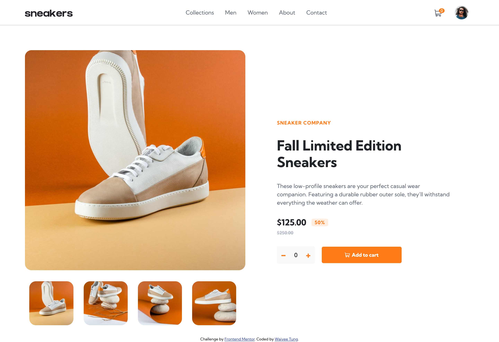

## Table of contents

- [Overview](#overview)
  - [The challenge](#the-challenge)
  - [Screenshot](#screenshot)
  - [Links](#links)
- [My process](#my-process)
  - [Built with](#built-with)
  - [Useful resources](#useful-resources)

## Overview

### The challenge

Users should be able to:

- View the optimal layout for the site depending on their device's screen size
- See hover states for all interactive elements on the page
- Open a lightbox gallery by clicking on the large product image
- Switch the large product image by clicking on the small thumbnail images
- Add items to the cart
- View the cart and remove items from it

### Screenshot

### Link

- Live Site URL: (https://waiyeetung.github.io/ecommerce-product-main/)

## My process

### Built with

- Semantic HTML5 markup
- CSS custom properties
- Flexbox
- CSS Grid
- Desktop-first workflow
- [Bootstrap](https://getbootstrap.com/)
- [jQuery](https://jquery.com/)

### Useful resources

- [Lightbox Tutorial](https://www.w3schools.com/howto/howto_js_lightbox.asp) - This has been a great guide to create a light box using concepts from modals and slideshows. 

- [Sidebar](https://bootstrapious.com/p/bootstrap-sidebar) - This article helped me understand the different ways to create a sidebar. Prior to this, I've only created navbar that collapsed into a hambuger menu and drops down from the top, this was a new experience for me. 
